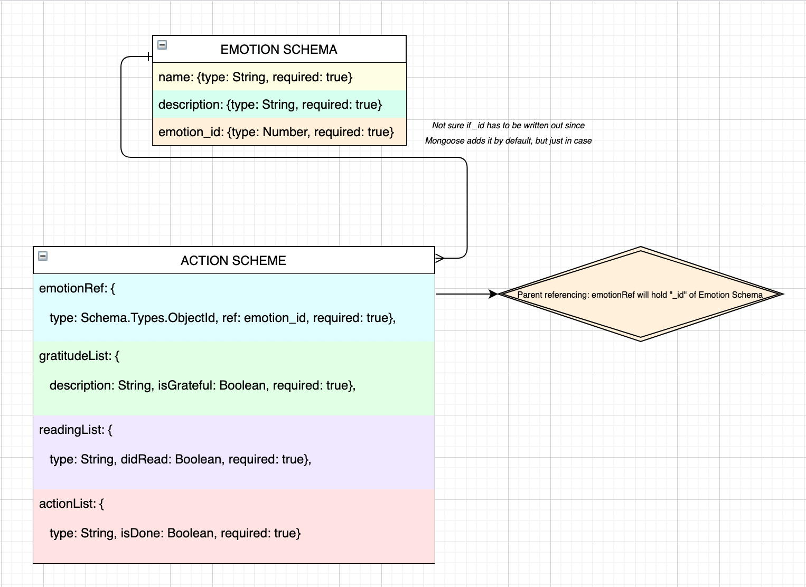
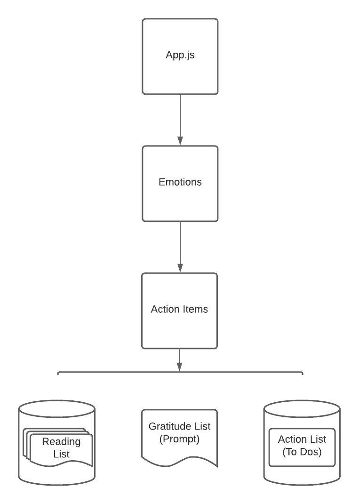

# Gratitude APPtitude (Project 2 - Fullstack App)
## May/June 2021
The concept and implementation for Gratitude APPtitude was created between 29 May - 04 Jun 2021.

## Idea & Code By: Bailey Leavitt

[Deployed (Check back soon)]() | [Creator's GitHub](https://www.github.com/baileyjean) | [Creator's LinkedIn](https://www.linkedin.com/in/baileyleavitt) | [Trello Board for Project](https://trello.com/b/OdlXsOEn/gratitudeapptitude)

***

## Description

**Gratitude APPtitude** is full-stack MERN app created for my Unit 2 capstone project in General Assembly's Software Engineering Immersive bootcamp. 

***

## Technologies Used
* HTML
* CSS
* Javascript
* MongoDB
* Mongoose
* Express
* React
* Node.js

***

## Getting Started
* **Gratitude APPtitude** is deployed on Heroku.
* The landing page gives context to this app, and describes the new model of human emotions, which is based on four basic human emotions. This will provide guidance on how to synthesize how you're feeling down to one of the four basic emotions.
* User can continue to next page, where they are prompted to select how they're feeling from a list of four basic emotions.
* Once user clicks one of the four basic emotions, the Action Items page loads with a confirmation of the user's choice.
* The first level of Action Items gives a brief description next steps for the user, while each proceeding page has blurbs on their respective purpose.
* Action Items: 
  * Gratitude List Prompt
  * Reading List
  * To Do List
* All Action Items are about empowering the user, and--when negative emotions are present--will guide the user to an action-filled, research-based approach to tackling even the most overwhelming of emotions.
* The UX for this app is predicated on idea that a lack of gratitude has a causal relationship to negative emotion, and the hope of **Gratitude APPtitude** is that it will help the user shift their perspective and grow their "aptitude for gratitude."

***

## App Design
### Screenshots from the Initial Design Process

#### Full Entity Relationship Diagram (ERD) for backend:

#### Component Hierarchy Diagram (CHD) for frontend:

***

## Requirements
- [] 2 Schemas
- [] POST, GET, DELETE operations
- [] Display data from each model on frontend
- [] React Router to navigate between pages
- [] Deployed on Heroku

***

## Future Improvements & Additions

***

## Credits
#### Tools Used:
- CANVA: [Logo Design](https://www.canva.com/)
- TRELLO: [Project Planning](https://trello.com/b/OdlXsOEn/gratitudeapptitude)
- APP.DIAGRAMS: [ERD](https://app.diagrams.net/)
- LUCID.APP: [CHD](https://www.lucidchart.com/pages/)

#### Citations:
- *[Computational Models of Face Perception](https://www.ncbi.nlm.nih.gov/pmc/articles/PMC5754021/)*
- *[Only Four Basic Emotions Exist, Researchers Say](http://www.sci-news.com/othersciences/psychology/science-four-basic-emotions-01742.html)*
- *[Our Basic Emotions](https://online.uwa.edu/infographics/basic-emotions/)*

