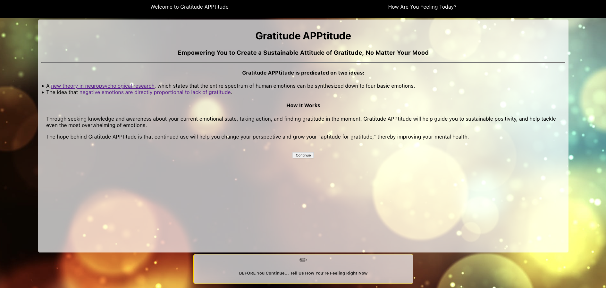
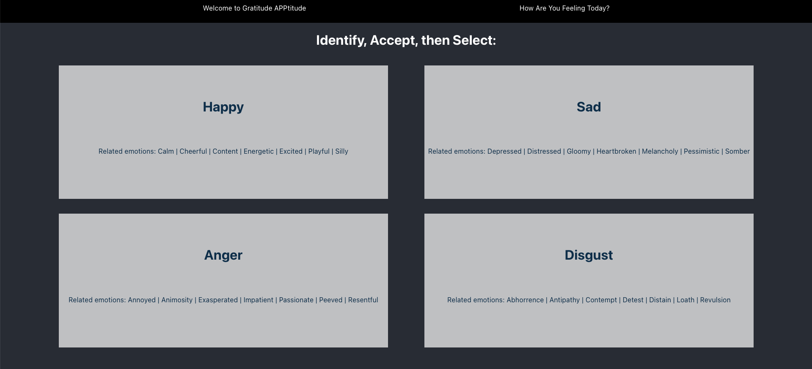
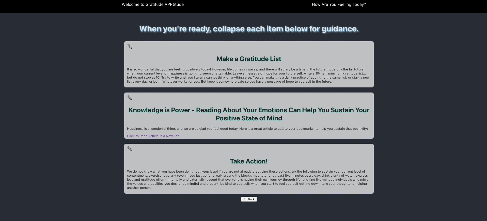

# Gratitude APPtitude (Project 2 - Fullstack App)
## June 2021
The initial implementation for Gratitude APPtitude was created between 01 Jun - 04 Jun 2021.

## Idea & Code By: Bailey Leavitt

[Deployed (Check back soon)]() | [Creator's GitHub](https://www.github.com/baileyjean) | [Creator's LinkedIn](https://www.linkedin.com/in/baileyleavitt) | [Trello Board for Project](https://trello.com/b/OdlXsOEn/gratitudeapptitude)

***

## Description

**Gratitude APPtitude** is full-stack MERN app created for my Unit 2 capstone project in General Assembly's Software Engineering Immersive bootcamp. 

***

## Technologies Used
* HTML
* CSS
* Javascript
* MongoDB
* Mongoose
* Express
* React
* Node.js

***

## Getting Started
* **Gratitude APPtitude** is deployed on Heroku.
* The landing page gives context to this app, and describes a new theory of human emotions, based on four basic human emotions. 
* You can add and delete comments in the collapsible comment box, and share how you feel today, before moving on.
* Once you continue to the next page, you are prompted to select how you feel from the list of four basic emotions. Each emotions provides similar emotions, in an effort to guide you on synthesizing down to one of the four basic emotions.
* Once you click how you're feeling, the Validation page loads with a list of actionables for you to go through.
* Actionables: 
  * Gratitude Prompt
  * Suggested Reading
  * Take Action List
* All Actionables are meant to empower you, and--when negative emotions are present--will guide you to an action-filled approach to tackling even the most overwhelming of emotions.
* The UX for this app is predicated on idea that a lack of gratitude has a causal relationship to negative emotion, and the hope of **Gratitude APPtitude** is that it will help the user shift their perspective and grow their "aptitude for gratitude."

***

## App Design
### Screenshots from the Finished Product

### Screenshots from the Initial Design Process

#### Full Entity Relationship Diagram (ERD) for backend:

#### Component Hierarchy Diagram (CHD) for frontend:

***

## Requirements
- [X] 2 Schemas
- [X] POST, GET, DELETE operations
- [X] Display data from each model on frontend
- [X] React Router to navigate between pages
- [] Deployed on Heroku

***

## Future Improvements & Additions

***

## Credits
#### Tools Used:
- CANVA: [Logo Design](https://www.canva.com/)
- TRELLO: [Project Planning](https://trello.com/b/OdlXsOEn/gratitudeapptitude)
- APP.DIAGRAMS: [ERD](https://app.diagrams.net/)
- LUCID.APP: [CHD](https://www.lucidchart.com/pages/)

#### Citations:
- *[Computational Models of Face Perception](https://www.ncbi.nlm.nih.gov/pmc/articles/PMC5754021/)*
- *[Only Four Basic Emotions Exist, Researchers Say](http://www.sci-news.com/othersciences/psychology/science-four-basic-emotions-01742.html)*
- *[Our Basic Emotions](https://online.uwa.edu/infographics/basic-emotions/)*
- *[Background Image for Landing Page](https://images.pexels.com/photos/220067/pexels-photo-220067.jpeg?auto=compress&cs=tinysrgb&dpr=2&h=750&w=1260)*

